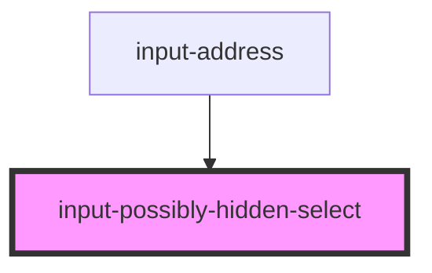

# input-possibly-hidden-select

<!-- Auto Generated Below -->

## Properties

| Property     | Attribute     | Description | Type                                 | Default     |
| ------------ | ------------- | ----------- | ------------------------------------ | ----------- |
| `fieldLabel` | `field-label` |             | `string`                             | `undefined` |
| `name`       | `name`        |             | `string`                             | `undefined` |
| `options`    | --            |             | `Map<string, string> \| Set<string>` | `undefined` |
| `selected`   | `selected`    |             | `string`                             | `undefined` |

## Dependencies

### Used by

 - [input-address](../input-address)

### Graph

----------------------------------------------

