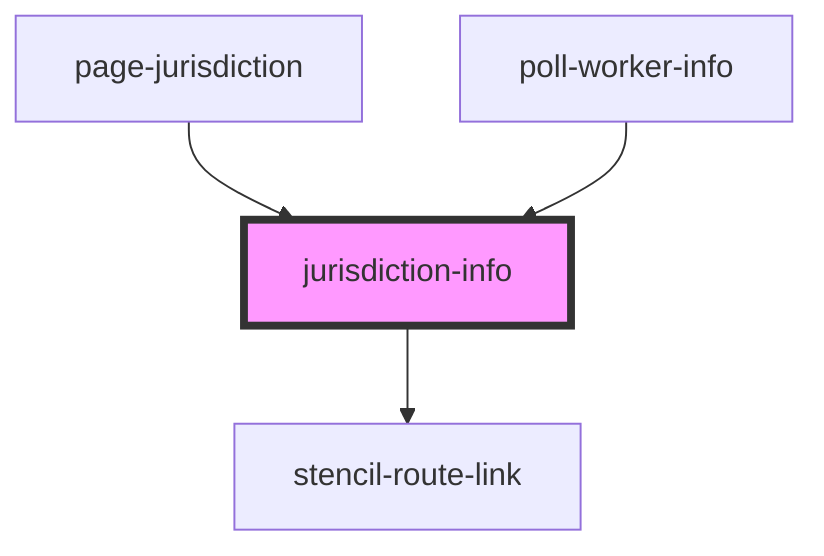

# jurisdiction-info

<!-- Auto Generated Below -->

## Properties

| Property         | Attribute         | Description                           | Type                            | Default     |
| ---------------- | ----------------- | ------------------------------------- | ------------------------------- | ----------- |
| `jurisdictionId` | `jurisdiction-id` | ID of jurisdiction for Work Elections | `number \| string \| undefined` | `undefined` |

## Dependencies

### Used by

 - [page-jurisdiction](../page-jurisdiction)
 - [poll-worker-info](../poll-worker-info)

### Depends on

- stencil-route-link

### Graph

----------------------------------------------

