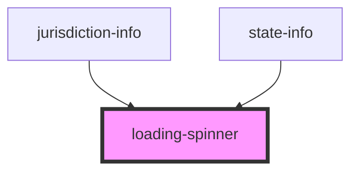

# loading-spinner

<!-- Auto Generated Below -->

## Properties

| Property | Attribute | Description | Type      | Default |
| -------- | --------- | ----------- | --------- | ------- |
| `dark`   | `dark`    |             | `boolean` | `false` |

## Dependencies

### Used by

 - [jurisdiction-info](../jurisdiction-info)
 - [state-info](../state-info)

### Graph

----------------------------------------------

