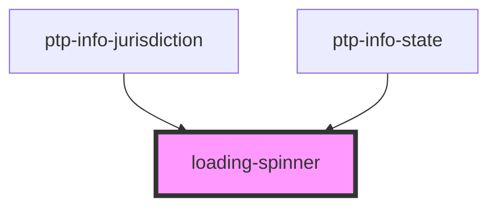

# loading-spinner

<!-- Auto Generated Below -->

## Properties

| Property | Attribute | Description | Type      | Default |
| -------- | --------- | ----------- | --------- | ------- |
| `dark`   | `dark`    |             | `boolean` | `false` |

## Dependencies

### Used by

 - [ptp-info-jurisdiction](../ptp-info-jurisdiction)
 - [ptp-info-state](../ptp-info-state)

### Graph

----------------------------------------------

