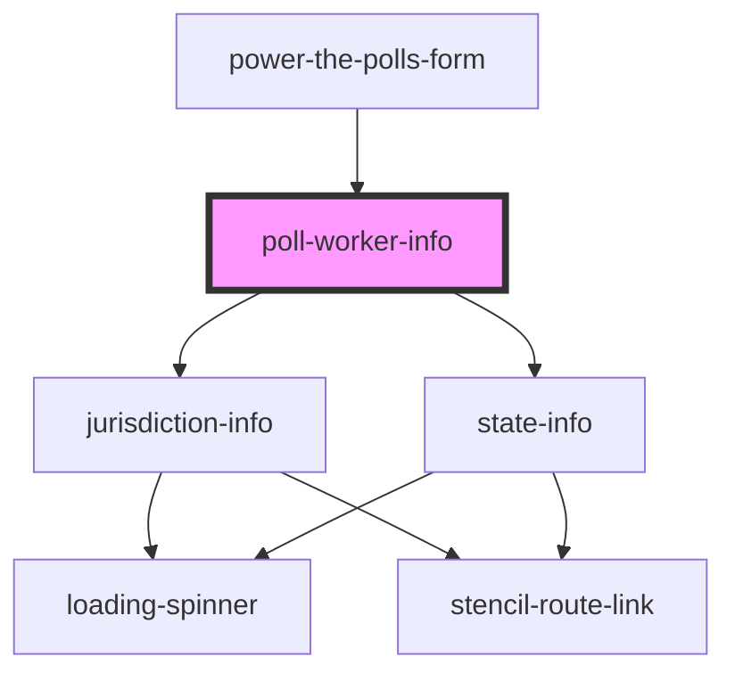

# work-elections

<!-- Auto Generated Below -->

## Properties

| Property   | Attribute | Description                      | Type                                                                                                                                                                                                                                                                                   | Default     |
| ---------- | --------- | -------------------------------- | -------------------------------------------------------------------------------------------------------------------------------------------------------------------------------------------------------------------------------------------------------------------------------------- | ----------- |
| `city`     | `city`    | City for matching to location    | `string \| undefined`                                                                                                                                                                                                                                                                  | `undefined` |
| `county`   | `county`  | County for matching to location  | `string \| undefined`                                                                                                                                                                                                                                                                  | `undefined` |
| `formData` | --        | Complete form data, if available | `undefined \| { name?: string \| undefined; city?: string \| undefined; county?: string \| undefined; zip?: string \| undefined; state?: string \| undefined; email?: string \| undefined; phone?: string \| undefined; languages?: string \| undefined; age?: string \| undefined; }` | `undefined` |
| `history`  | --        |                                  | `RouterHistory \| undefined`                                                                                                                                                                                                                                                           | `undefined` |
| `state`    | `state`   | State for matching to location   | `string \| undefined`                                                                                                                                                                                                                                                                  | `undefined` |

## Dependencies

### Used by

 - [power-the-polls-form](../power-the-polls-form)

### Depends on

- [jurisdiction-info](../jurisdiction-info)
- [state-info](../state-info)

### Graph

----------------------------------------------

