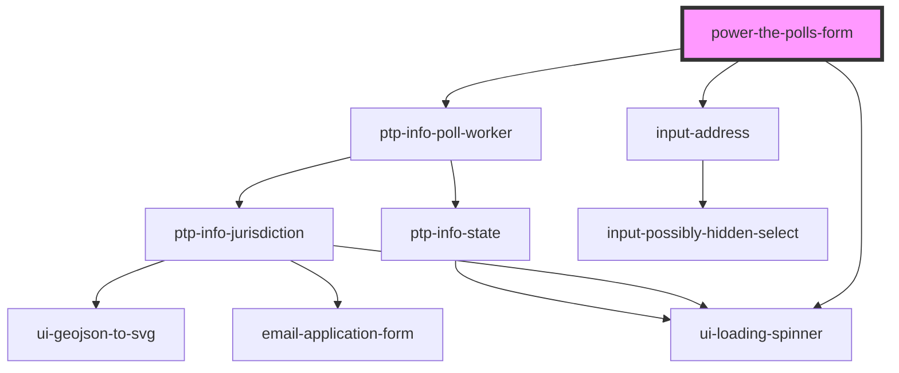

# power-the-polls-form

<!-- Auto Generated Below -->

## Properties

| Property               | Attribute                 | Description                                                                                                                | Type                   | Default     |
| ---------------------- | ------------------------- | -------------------------------------------------------------------------------------------------------------------------- | ---------------------- | ----------- |
| `customFormFieldLabel` | `custom-form-field-label` | The label for an additional field to be displayed on the signup form. If undefined, no additional field will be displayed. | `string \| undefined`  | `undefined` |
| `optUserOutOfChase`    | `opt-user-out-of-chase`   |                                                                                                                            | `boolean \| undefined` | `undefined` |
| `partnerId`            | `partner-id`              | To display custom text and images for a specific Power the Polls partner, enter their ID here.                             | `string \| undefined`  | `undefined` |
| `partnerName`          | `partner-name`            | Optional name displayed in privacy policy disclaimer when `optUserOutOfChase` is true                                      | `string \| undefined`  | `undefined` |
| `smartyStreetsApiKey`  | `smarty-streets-api-key`  | The API key to access SmartyStreets which is used for address lookup.                                                      | `string \| undefined`  | `undefined` |

## Events

| Event             | Description                                                                                     | Type               |
| ----------------- | ----------------------------------------------------------------------------------------------- | ------------------ |
| `submitCompleted` | Dispatched when the user has submitted the form and it has successfully POSTed to `destination` | `CustomEvent<any>` |
| `submitError`     | Dispatched when there is an error submitting the form to `destination`                          | `CustomEvent<any>` |

## Methods

### `reset() => Promise<void>`

#### Returns

Type: `Promise<void>`

### `version() => Promise<string>`

The version of this `power-the-polls-form` component

#### Returns

Type: `Promise<string>`

## Dependencies

### Depends on

- [ptp-info-poll-worker](../ptp-info-poll-worker)
- [input-address](../input-address)
- [ui-loading-spinner](../ui-loading-spinner)

### Graph

----------------------------------------------

