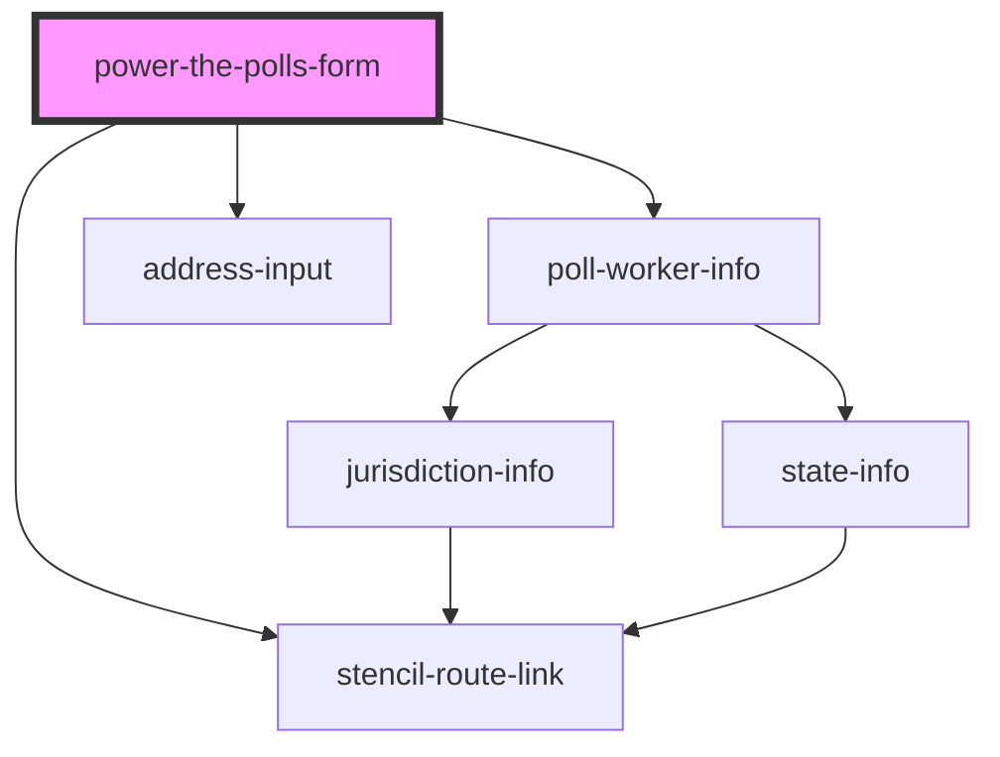

# power-the-polls-form

<!-- Auto Generated Below -->

## Properties

| Property               | Attribute                 | Description                                                                                                                | Type                  | Default                                       |
| ---------------------- | ------------------------- | -------------------------------------------------------------------------------------------------------------------------- | --------------------- | --------------------------------------------- |
| `customFormFieldLabel` | `custom-form-field-label` | The label for an additional field to be displayed on the signup form. If undefined, no additional field will be displayed. | `string \| undefined` | `undefined`                                   |
| `destination`          | `destination`             | The URL where the form data will be submitted                                                                              | `string`              | `"https://ptp.actionkit.com/rest/v1/action/"` |
| `optUserOutOfChase`    | `opt-user-out-of-chase`   |                                                                                                                            | `boolean`             | `false`                                       |
| `partnerId`            | `partner-id`              | To display custom text and images for a specific Power the Polls partner, enter their ID here.                             | `string \| undefined` | `undefined`                                   |
| `smartyStreetsApiKey`  | `smarty-streets-api-key`  | The API key to access SmartyStreets which is used for address lookup.                                                      | `string \| undefined` | `undefined`                                   |

## Events

| Event             | Description                                                                                     | Type               |
| ----------------- | ----------------------------------------------------------------------------------------------- | ------------------ |
| `submitCompleted` | Dispatched when the user has submitted the form and it has successfully POSTed to `destination` | `CustomEvent<any>` |
| `submitError`     | Dispatched when there is an error submitting the form to `destination`                          | `CustomEvent<any>` |

## Dependencies

### Depends on

- [poll-worker-info](../poll-worker-info)
- [address-input](../address-input)
- stencil-route-link

### Graph

----------------------------------------------

