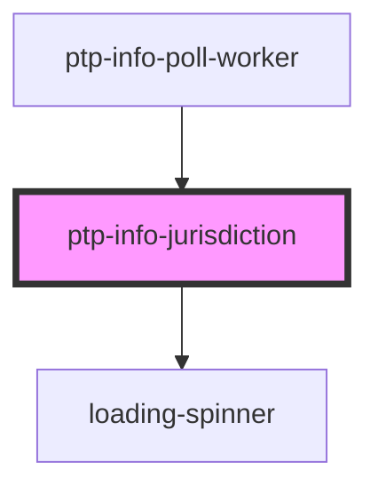

# ptp-info-jurisdiction

<!-- Auto Generated Below -->

## Properties

| Property         | Attribute         | Description                            | Type                                                                                                                                                                                                                                                                                                                                                         | Default     |
| ---------------- | ----------------- | -------------------------------------- | ------------------------------------------------------------------------------------------------------------------------------------------------------------------------------------------------------------------------------------------------------------------------------------------------------------------------------------------------------------ | ----------- |
| `addtl`          | --                | Props possibly passed in from the form | `undefined \| { name?: string \| undefined; city?: string \| undefined; county?: string \| undefined; zip?: string \| undefined; address1?: string \| undefined; state?: string \| undefined; email?: string \| undefined; phone?: string \| undefined; languages?: string \| undefined; age?: string \| undefined; jurisdictionId?: string \| undefined; }` | `undefined` |
| `jurisdictionId` | `jurisdiction-id` | ID of jurisdiction for Work Elections  | `number \| string \| undefined`                                                                                                                                                                                                                                                                                                                              | `undefined` |

## Dependencies

### Used by

 - [ptp-info-poll-worker](../ptp-info-poll-worker)

### Depends on

- [loading-spinner](../loading-spinner)

### Graph

----------------------------------------------

