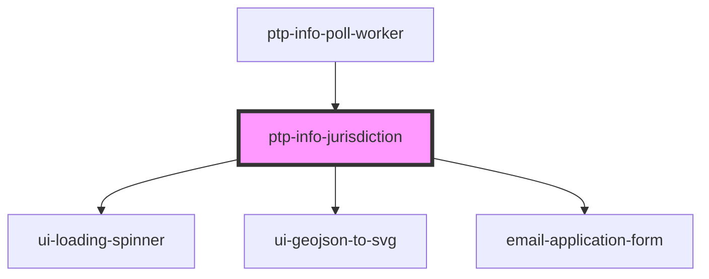

# ptp-info-jurisdiction

<!-- Auto Generated Below -->

## Properties

| Property          | Attribute         | Description                                                                                   | Type                                                                                                                                                                                                                                                                                                                                                         | Default     |
| ----------------- | ----------------- | --------------------------------------------------------------------------------------------- | ------------------------------------------------------------------------------------------------------------------------------------------------------------------------------------------------------------------------------------------------------------------------------------------------------------------------------------------------------------ | ----------- |
| `initialFormData` | --                | Props possibly passed in from the main form                                                   | `undefined \| { name?: string \| undefined; city?: string \| undefined; county?: string \| undefined; zip?: string \| undefined; address1?: string \| undefined; state?: string \| undefined; email?: string \| undefined; phone?: string \| undefined; languages?: string \| undefined; age?: string \| undefined; jurisdictionId?: string \| undefined; }` | `undefined` |
| `jurisdictionId`  | `jurisdiction-id` | ID of jurisdiction for Work Elections                                                         | `number \| string \| undefined`                                                                                                                                                                                                                                                                                                                              | `undefined` |
| `showNextSteps`   | `show-next-steps` | If `true`, this component will lso render 1-3 bullet items indicating next steps for the user | `boolean`                                                                                                                                                                                                                                                                                                                                                    | `undefined` |

## Dependencies

### Used by

 - [ptp-info-poll-worker](../ptp-info-poll-worker)

### Depends on

- [ui-loading-spinner](../ui-loading-spinner)
- [ui-geojson-to-svg](../ui-geojson-to-svg)
- [email-application-form](.)

### Graph

----------------------------------------------

