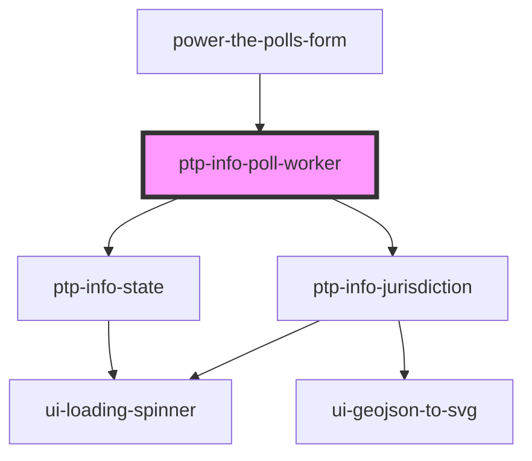

# work-elections

<!-- Auto Generated Below -->

## Properties

| Property        | Attribute         | Description                                                                                   | Type                                                                                                                                                                                                                                                                                                                                                         | Default     |
| --------------- | ----------------- | --------------------------------------------------------------------------------------------- | ------------------------------------------------------------------------------------------------------------------------------------------------------------------------------------------------------------------------------------------------------------------------------------------------------------------------------------------------------------ | ----------- |
| `city`          | `city`            | City for matching to location                                                                 | `string \| undefined`                                                                                                                                                                                                                                                                                                                                        | `undefined` |
| `county`        | `county`          | County for matching to location                                                               | `string \| undefined`                                                                                                                                                                                                                                                                                                                                        | `undefined` |
| `formData`      | --                | Complete form data, if available, for `ptp-info-jurisdiction`                                 | `undefined \| { name?: string \| undefined; city?: string \| undefined; county?: string \| undefined; zip?: string \| undefined; address1?: string \| undefined; state?: string \| undefined; email?: string \| undefined; phone?: string \| undefined; languages?: string \| undefined; age?: string \| undefined; jurisdictionId?: string \| undefined; }` | `undefined` |
| `showNextSteps` | `show-next-steps` | If `true`, this component will lso render 1-3 bullet items indicating next steps for the user | `boolean`                                                                                                                                                                                                                                                                                                                                                    | `undefined` |
| `state`         | `state`           | State for matching to location                                                                | `string \| undefined`                                                                                                                                                                                                                                                                                                                                        | `undefined` |

## Dependencies

### Used by

 - [power-the-polls-form](../power-the-polls-form)

### Depends on

- [ptp-info-jurisdiction](../ptp-info-jurisdiction)
- [ptp-info-state](../ptp-info-state)

### Graph

----------------------------------------------

