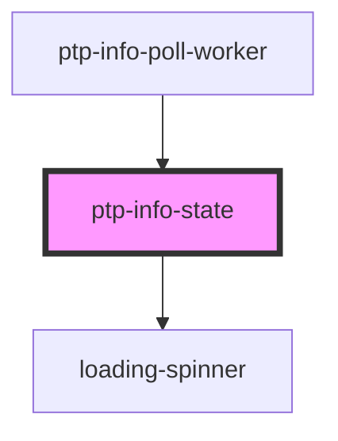

# ptp-info-state

<!-- Auto Generated Below -->

## Properties

| Property | Attribute | Description        | Type                  | Default     |
| -------- | --------- | ------------------ | --------------------- | ----------- |
| `state`  | `state`   | State abbreviation | `string \| undefined` | `undefined` |

## Dependencies

### Used by

 - [ptp-info-poll-worker](../ptp-info-poll-worker)

### Depends on

- [loading-spinner](../loading-spinner)

### Graph

----------------------------------------------

