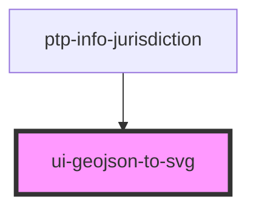

# ui-geojson-to-svg

Renders GeoJSON for each jurisdiction.

Adapted from:
https://github.com/gagan-bansal/geojson2svg
https://github.com/geosquare/multigeojson 
http://mikefowler.me/journal/2014/06/10/drawing-geojson-in-a-canvas

<!-- Auto Generated Below -->

## Properties

| Property  | Attribute | Description | Type                                                                                                                                                                                                                                                                                     | Default     |
| --------- | --------- | ----------- | ---------------------------------------------------------------------------------------------------------------------------------------------------------------------------------------------------------------------------------------------------------------------------------------- | ----------- |
| `geoJson` | --        |             | `Feature<Geometry, GeoJsonProperties> \| FeatureCollection<Geometry, GeoJsonProperties> \| GeometryCollection \| LineString \| MultiLineString \| MultiPoint \| MultiPolygon \| Point \| Polygon \| undefined`                                                                           | `undefined` |
| `height`  | `height`  |             | `number`                                                                                                                                                                                                                                                                                 | `undefined` |
| `options` | --        |             | `undefined \| { bounds?: BoundsRectangle \| undefined; scale: number; attributes?: any[] \| { [key: string]: string; } \| undefined; pointAsCircle?: boolean \| undefined; output?: "svg" \| "paths" \| undefined; explode?: boolean \| undefined; pointRadius?: number \| undefined; }` | `undefined` |
| `width`   | `width`   |             | `number`                                                                                                                                                                                                                                                                                 | `undefined` |

## Dependencies

### Used by

 - [ptp-info-jurisdiction](../ptp-info-jurisdiction)

### Graph

----------------------------------------------

