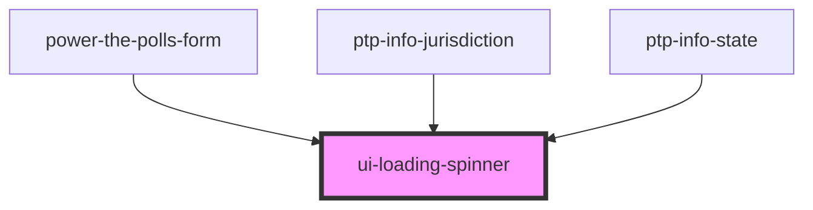

# ui-loading-spinner

<!-- Auto Generated Below -->

## Properties

| Property | Attribute | Description | Type      | Default     |
| -------- | --------- | ----------- | --------- | ----------- |
| `small`  | `small`   |             | `boolean` | `undefined` |

## Shadow Parts

| Part     | Description |
| -------- | ----------- |
| `"cube"` |             |

## Dependencies

### Used by

 - [power-the-polls-form](../power-the-polls-form)
 - [ptp-info-jurisdiction](../ptp-info-jurisdiction)
 - [ptp-info-state](../ptp-info-state)

### Graph

----------------------------------------------

