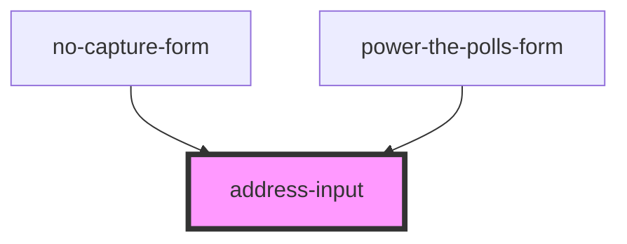

# address-input

<!-- Auto Generated Below -->

## Properties

| Property              | Attribute                | Description                                                                                                              | Type                  | Default     |
| --------------------- | ------------------------ | ------------------------------------------------------------------------------------------------------------------------ | --------------------- | ----------- |
| `lookupDelay`         | `lookup-delay`           | Delay, in ms, between user pressing a key while entering an address and the API call being made, in ms. (default: 200ms) | `number`              | `undefined` |
| `showStateSelect`     | `show-state-select`      | The state to narrow-down the address search to                                                                           | `boolean`             | `undefined` |
| `smartyStreetsApiKey` | `smarty-streets-api-key` | The API key to access the SmartyStreets API                                                                              | `string \| undefined` | `undefined` |

## Dependencies

### Used by

 - [no-capture-form](../no-capture-form)
 - [power-the-polls-form](../power-the-polls-form)

### Graph

----------------------------------------------

