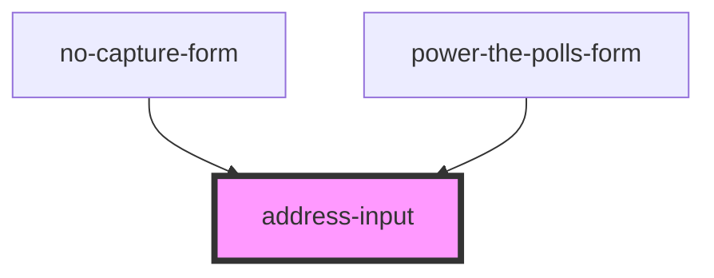

# address-input

<!-- Auto Generated Below -->

## Properties

| Property              | Attribute                | Description                                                                                                              | Type     | Default     |
| --------------------- | ------------------------ | ------------------------------------------------------------------------------------------------------------------------ | ---------| ----------- |
| `smartyStreetsApiKey` | `smarty-streets-api-key` | The API key to access the SmartyStreets API                                                                              | `string` |             |

## Dependencies

### Used by

 - [no-capture-form](../no-capture-form)
 - [power-the-polls-form](../power-the-polls-form)

### Graph

----------------------------------------------

