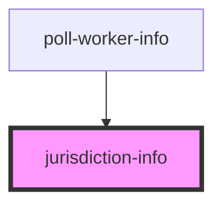

# jurisdiction-info

<!-- Auto Generated Below -->

## Properties

| Property         | Attribute         | Description                   | Type                  | Default     |
| ---------------- | ----------------- | ----------------------------- | --------------------- | ----------- |
| `jurisdictionId` | `jurisdiction-id` | City for matching to location | `number \| undefined` | `undefined` |

## Dependencies

### Used by

 - [poll-worker-info](../poll-worker-info)

### Graph

----------------------------------------------

