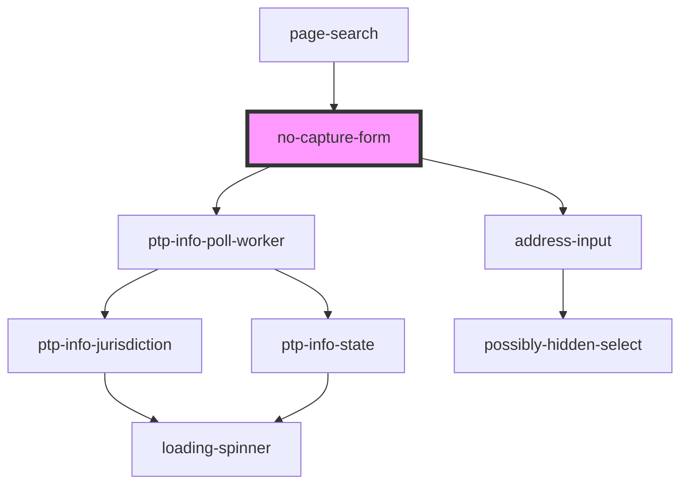

# no-capture-form

<!-- Auto Generated Below -->

## Dependencies

### Used by

 - [page-search](../page-search)

### Depends on

- ptp-info-poll-worker
- address-input

### Graph

----------------------------------------------

