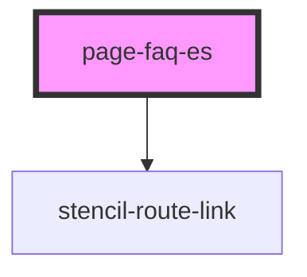

# page-faq-es

<!-- Auto Generated Below -->

## Properties

| Property    | Attribute    | Description                                                               | Type                                                   | Default     |
| ----------- | ------------ | ------------------------------------------------------------------------- | ------------------------------------------------------ | ----------- |
| `data`      | --           | A list of entries to display in the FAQ see: FaqData.ts see: app-root.tsx | `undefined \| { question: string; answer: string; }[]` | `undefined` |
| `pageTitle` | `page-title` | The page's title                                                          | `string \| undefined`                                  | `undefined` |

## Dependencies

### Depends on

- stencil-route-link

### Graph

----------------------------------------------

