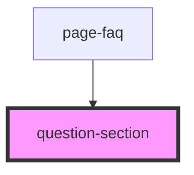

# page-faq

Faq Page imports faq data and formats it using the question section component. 
It has a contact modal with a form that feeds directly to helpscout via zapier webhook. 

<!-- Auto Generated Below -->

## Properties

| Property       | Attribute       | Description | Type                                                           | Default     |
| -------------- | --------------- | ----------- | -------------------------------------------------------------- | ----------- |
| `questions`    | --              |             | `undefined \| ({ question: string; answer: () => string; }[])` | `undefined` |
| `sectionTitle` | `section-title` |             | `string \| undefined`                                          | `undefined` |

## Dependencies

### Used by

 - [page-faq](.)

### Graph

----------------------------------------------

