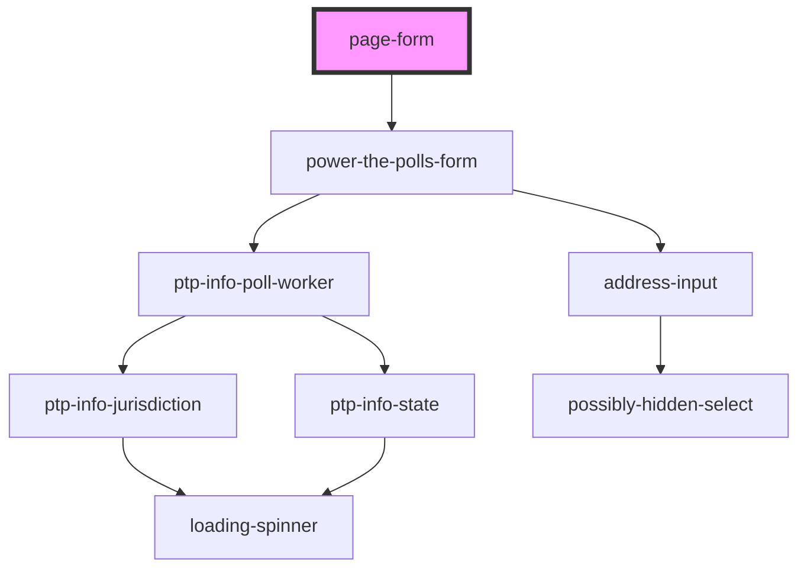

# page-form

<!-- Auto Generated Below -->

## Properties

| Property    | Attribute    | Description                                                                                                                                                            | Type                  | Default     |
| ----------- | ------------ | ---------------------------------------------------------------------------------------------------------------------------------------------------------------------- | --------------------- | ----------- |
| `partnerId` | `partner-id` | Optional partnerId/source parameter to use when submitting the form. If the partnerId exists in `/data/PartnerList.ts` then additional partner data will be looked up. | `string \| undefined` | `undefined` |

## Dependencies

### Depends on

- power-the-polls-form

### Graph

----------------------------------------------

