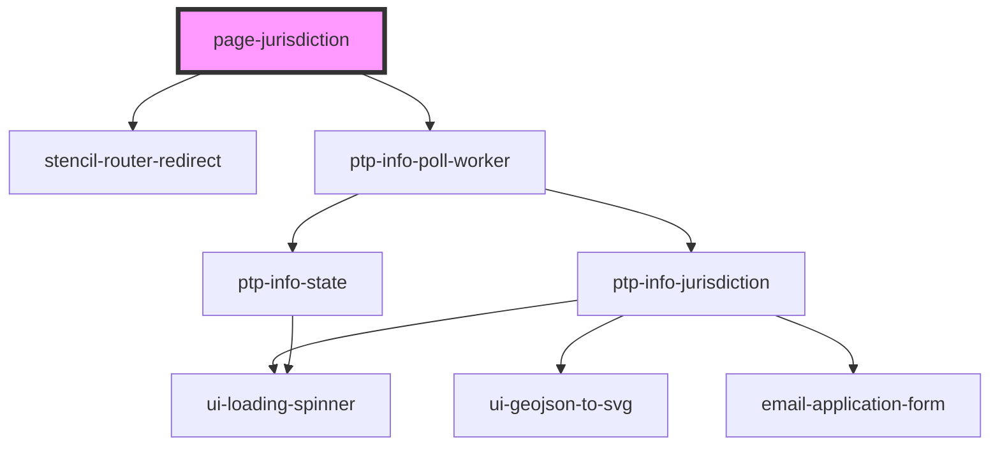

# page-jurisdiction

<!-- Auto Generated Below -->

## Properties

| Property | Attribute | Description | Type                        | Default     |
| -------- | --------- | ----------- | --------------------------- | ----------- |
| `match`  | --        |             | `MatchResults \| undefined` | `undefined` |

## Dependencies

### Depends on

- stencil-router-redirect
- ptp-info-poll-worker

### Graph

----------------------------------------------

