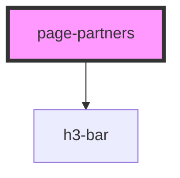

# page-partners

<!-- Auto Generated Below -->

## Properties

| Property   | Attribute | Description                              | Type                     | Default     |
| ---------- | --------- | ---------------------------------------- | ------------------------ | ----------- |
| `partners` | --        | List of all the partner logos to display | `Partner[] \| undefined` | `undefined` |

## Dependencies

### Depends on

- [h3-bar](../h3-bar)

### Graph

----------------------------------------------

