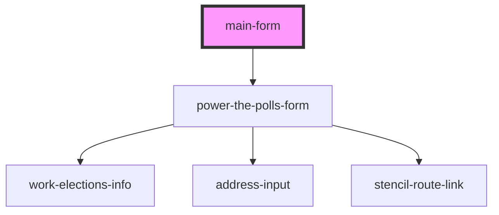

# main-form

<!-- Auto Generated Below -->

## Properties

| Property              | Attribute                | Description                                                           | Type                  | Default     |
| --------------------- | ------------------------ | --------------------------------------------------------------------- | --------------------- | ----------- |
| `smartyStreetsApiKey` | `smarty-streets-api-key` | The API key to access SmartyStreets which is used for address lookup. | `string \| undefined` | `undefined` |

## Dependencies

### Depends on

- [power-the-polls-form](../../power-the-polls-form)

### Graph

----------------------------------------------

