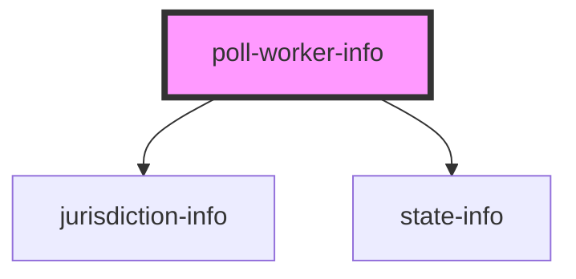

# work-elections

<!-- Auto Generated Below -->

## Properties

| Property | Attribute | Description                     | Type                  | Default     |
| -------- | --------- | ------------------------------- | --------------------- | ----------- |
| `city`   | `city`    | City for matching to location   | `string \| undefined` | `undefined` |
| `county` | `county`  | County for matching to location | `string \| undefined` | `undefined` |
| `state`  | `state`   | State for matching to location  | `string \| undefined` | `undefined` |

## Dependencies

### Depends on

- [jurisdiction-info](../jurisdiction-info)
- [state-info](../state-info)

### Graph

----------------------------------------------

