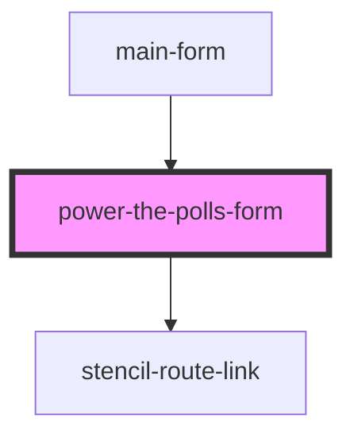

# power-the-polls-form

<!-- Auto Generated Below -->

## Properties

| Property               | Attribute                 | Description                                                                                    | Type                  | Default                            |
| ---------------------- | ------------------------- | ---------------------------------------------------------------------------------------------- | --------------------- | ---------------------------------- |
| `customFormFieldLabel` | `custom-form-field-label` | The label for an additional field to be displayed on the signup form                           | `string \| undefined` | `undefined`                        |
| `destination`          | `destination`             | The URL where the form data will be submitted                                                  | `string`              | `"https://ptp.actionkit.com/act/"` |
| `optUserOutOfChase`    | `opt-user-out-of-chase`   |                                                                                                | `boolean`             | `false`                            |
| `partnerId`            | `partner-id`              | To display custom text and images for a specific Power the Polls partner, enter their ID here. | `string \| undefined` | `undefined`                        |

## Dependencies

### Used by

 - [main-form](../pages/main-form)

### Depends on

- stencil-route-link

### Graph

----------------------------------------------

