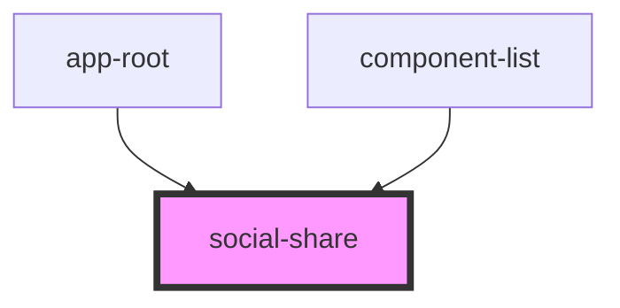

# social-share

<!-- Auto Generated Below -->

## Properties

| Property    | Attribute   | Description                                                       | Type                  | Default     |
| ----------- | ----------- | ----------------------------------------------------------------- | --------------------- | ----------- |
| `analytics` | `analytics` | Key to send for analytics when user selects this social share     | `string \| undefined` | `undefined` |
| `cta`       | `cta`       | The displayed call-to-action text                                 | `string \| undefined` | `undefined` |
| `image`     | `image`     | Image to use from assets/images/social/*                          | `string \| undefined` | `undefined` |
| `name`      | `name`      | The full name of the social network. Used as the link title text. | `string \| undefined` | `undefined` |
| `url`       | `url`       | href for anchor (will open in a new window)                       | `string \| undefined` | `undefined` |

## Dependencies

### Used by

 - [app-root](../app-root)
 - [component-list](../component-list)

### Graph

----------------------------------------------

*Built with [StencilJS](https://stenciljs.com/)*
