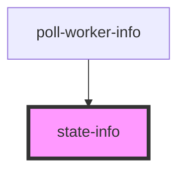

# state-info

<!-- Auto Generated Below -->

## Properties

| Property  | Attribute  | Description                | Type                  | Default     |
| --------- | ---------- | -------------------------- | --------------------- | ----------- |
| `state`   | `state`    | State abrieviation         | `string \| undefined` | `undefined` |
| `stateId` | `state-id` | State id in work elections | `null \| number`      | `null`      |

## Dependencies

### Used by

 - [poll-worker-info](../poll-worker-info)

### Graph

----------------------------------------------

