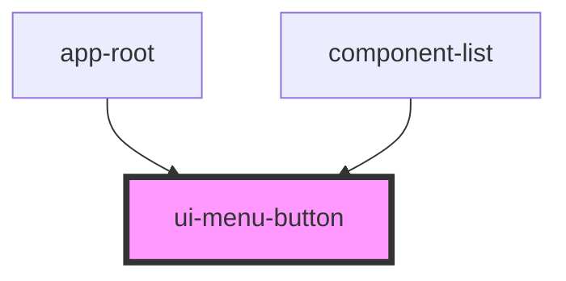

# ui-menu-button

<!-- Auto Generated Below -->

## Properties

| Property   | Attribute   | Description | Type                   | Default     |
| ---------- | ----------- | ----------- | ---------------------- | ----------- |
| `isActive` | `is-active` |             | `boolean \| undefined` | `undefined` |
| `label`    | `label`     | aria-label  | `string \| undefined`  | `undefined` |

## Events

| Event    | Description | Type                        |
| -------- | ----------- | --------------------------- |
| `toggle` |             | `CustomEvent<UiMenuButton>` |

## Dependencies

### Used by

 - [app-root](../app-root)
 - [component-list](../component-list)

### Graph

----------------------------------------------

