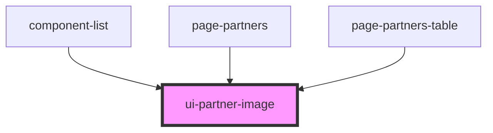

# ui-partner-image

<!-- Auto Generated Below -->

## Properties

| Property              | Attribute                | Description                                                                                                                                                                            | Type                  | Default     |
| --------------------- | ------------------------ | -------------------------------------------------------------------------------------------------------------------------------------------------------------------------------------- | --------------------- | ----------- |
| `chosenPartnerId`     | `chosen-partner-id`      | If this value matches the `partner` ID then the image will have the `chosen-partner` class added which currently pulses the image.                                                     | `string \| undefined` | `undefined` |
| `excludeAnchor`       | `exclude-anchor`         | By default, an empty  with an id set to the partnerId is added to this component. If you don't want to pollute the ID space, you can exclude that span by setting this to `true` | `boolean`             | `undefined` |
| `partner`             | `partner`                | A `Partner` object or partnerID string                                                                                                                                                 | `Partner \| string`   | `undefined` |
| `sourceFromDevBranch` | `source-from-dev-branch` | If `true` the image will not be loaded from the deployed assets but from the `partner-updates` branch on GitHub                                                                        | `boolean`             | `undefined` |

## Dependencies

### Used by

 - [component-list](../component-list)
 - [page-partners](../page-partners)
 - [page-partners-table](../page-partners-table)

### Graph

----------------------------------------------

