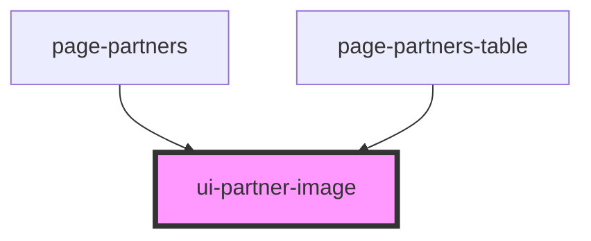

# ui-partner-image

<!-- Auto Generated Below -->

## Properties

| Property              | Attribute                | Description                                                                                                     | Type                  | Default     |
| --------------------- | ------------------------ | --------------------------------------------------------------------------------------------------------------- | --------------------- | ----------- |
| `chosenPartner`       | `chosen-partner`         |                                                                                                                 | `string \| undefined` | `undefined` |
| `excludeAnchor`       | `exclude-anchor`         |                                                                                                                 | `boolean`             | `undefined` |
| `partner`             | --                       |                                                                                                                 | `Partner`             | `undefined` |
| `sourceFromDevBranch` | `source-from-dev-branch` | If `true` the image will not be loaded from the deployed assets but from the `partner-updates` branch on GitHub | `boolean`             | `undefined` |

## Dependencies

### Used by

 - [page-partners](../page-partners)
 - [page-partners-table](../page-partners-table)

### Graph

----------------------------------------------

