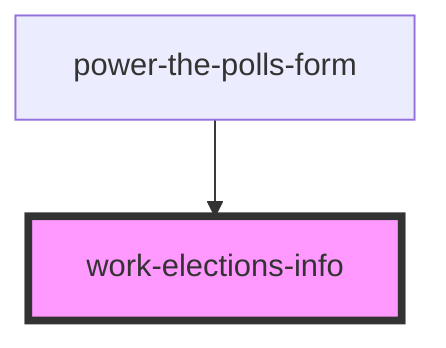

# work-elections-info

<!-- Auto Generated Below -->

## Properties

| Property       | Attribute | Description | Type                                     | Default     |
| -------------- | --------- | ----------- | ---------------------------------------- | ----------- |
| `jurisdiction` | --        |             | `JurisdictionQueryResponse \| undefined` | `undefined` |

## Dependencies

### Used by

 - [power-the-polls-form](../power-the-polls-form)

### Graph

----------------------------------------------

